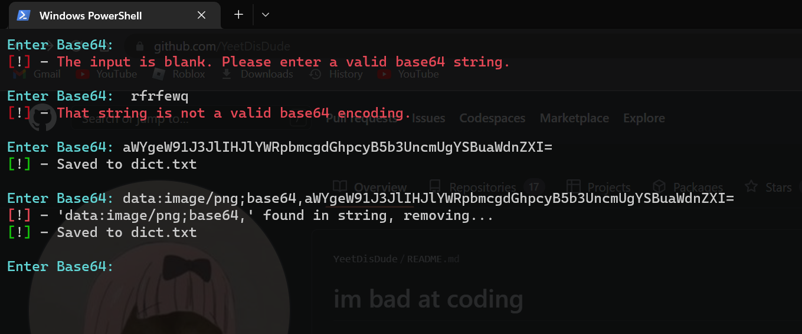

# Plist generator for zombiegun3d.plist
This is for making modded skin packs for ***iOS*** Pixel Gun 3D. I am not explaining how to use this as you should figure out how to use it your self
## Important
- *dict.txt* will be overwritten once the python script is ran
-  Use if you know what you're doing 
- This is for iOS Plist files!
- No need **pip install** the modules

## Whats new
- Now looks more beatiful with Colorama
- The script now validates if the base64 is valid or not
- You can paste base64 with the "data:image/png;base64," prefix and the script will automatically remvove it
- New log file because the script will overwrite the dict.txt but logfile.txt wont be overwritten
- Checks the base64 input

## Plist file format:

- ***current equiped skin:***

\<key>Name Current Skin\</key>

\<string>\</string>

- ***skin base64:***

\<key>User Skins\</key>

\<string>\</string>

- ***skin names:***

\<key>User Name Skins\</key>

\<string>\</string>
